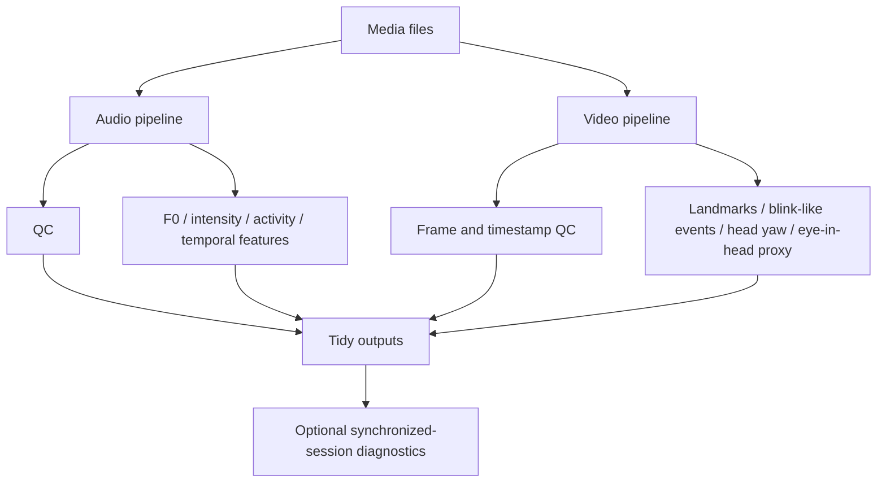

# Multimodal Audio-Video Signal Analysis

A Python toolkit for extracting acoustic and video-based behavioral features from recorded media, with emphasis on reproducibility, quality control, missing-data handling, and scientifically cautious interpretation.

## Overview

This repository is a generic public portfolio project for local audio/video signal analysis. It accepts arbitrary media filenames, supports single recordings by default, and only performs session-level synchronization diagnostics when recordings are explicitly configured as synchronized.

Recordings, extracted audio, frames, face images, caches, and generated results are excluded from git. The demo strategy uses synthetic audio and utility-level ocular tests; video examples require a local user-provided recording because this repository intentionally does not distribute identifiable face data.

## Features

### Acoustic

- media decoding and stream inspection;
- signal QC for clipping, DC offset, RMS/dBFS, and broad spectral bands;
- F0 trajectories and robust summary statistics;
- semitone-based pitch variability;
- relative intensity and high-energy gating;
- voice/activity detection with explicit heuristic labeling;
- temporal activity features and time-resolved trajectories.

### Video / Ocular

- resolution, FPS, frame-count, duration, and frame timestamp QC;
- MediaPipe face-landmark integration point for local user-provided model weights;
- face-present and usable-data masks;
- blink-like event and prolonged-closure summaries;
- head yaw kept separate from eye movement;
- normalized horizontal eye-in-head proxy;
- rapid horizontal eye-proxy change detection;
- missing-data-aware filtering that does not bridge invalid gaps.

### Multimodal / Session-Level

- independent single-file analysis by default;
- optional synchronized-session mode for arbitrary `N >= 2` recordings;
- audio-envelope cross-correlation lag diagnostics;
- duration/sample-rate/FPS comparison hooks;
- tidy feature tables suitable for reproducible analysis.

## Architecture



## Installation

Python 3.13 is used because the pinned dependency set is intended for that version.

```bash
python -m venv .venv
.venv\Scripts\activate
pip install -r requirements-dev.txt
pip install -e .
```

## Quick Start

Generate synthetic audio:

```bash
python examples/generate_demo_audio.py
```

Inspect or analyze a file:

```bash
python -m multimodal_signals.cli inspect data/demo_synthetic_voice.wav
python -m multimodal_signals.cli analyze data/demo_synthetic_voice.wav --output outputs/
python -m multimodal_signals.cli session configs/example_session.json --output outputs/
```

Use the public API:

```python
from multimodal_signals import analyze_audio, analyze_recording

audio = analyze_audio("data/demo_synthetic_voice.wav")
recording = analyze_recording("data/local_recording.mp4")
```

## Input Formats

The pipeline is designed for:

- MP4 or similar containers with audio and video;
- audio-only WAV/media files;
- video files without audio;
- multiple independent files;
- explicitly synchronized multi-camera or multi-microphone sessions;
- different durations, sampling rates, channel counts, FPS values, and arbitrary filenames.

Stereo audio requires an explicit choice: keep all channels, select one channel, or convert to mono. The default public pipeline uses mono only because many feature extractors expect a single waveform.

## Outputs

CLI runs write tidy CSVs under `outputs/`, for example:

- `recording_summary.csv`
- `acoustic_features.csv`
- per-recording activity time series such as `demo_synthetic_voice_activity.csv`
- `sync_qc.csv` for explicitly synchronized sessions

Rows include recording identifiers, modality labels, duration, QC states, warnings, and feature values.

## Privacy

All processing is local. This repository intentionally excludes raw media, extracted audio, frames, face crops, caches, per-recording private tables, and plots. Users should keep local recordings in ignored folders such as `data/` or `media/`.

## Methodological Limitations

- VAD/activity output is not ground-truth speech annotation.
- Cross-channel dominance or attribution, if extended, should be treated as heuristic rather than validated diarisation.
- Relative dB/dBFS features are recording levels, not calibrated SPL unless calibrated data are provided.
- The normalized horizontal eye-in-head proxy is not calibrated gaze, gaze angle, line of sight, or a target estimate.
- Head yaw and eye-in-head movement are different components. The current implementation estimates head yaw and a horizontal iris-based eye-in-head proxy separately and does not combine them into calibrated gaze.
- Blink-like and proxy-shift events are heuristic detector outputs.
- Cross-stream synchronization diagnostics are consistency checks, not proof of exact audio/video clock synchronization.

## Tests

```bash
pytest
```

The tests use synthetic arrays and generated signals only.

## References

- De Looze, C., & Hirst, D. J. (2008). Detecting changes in key and range for the automatic modelling and coding of intonation.
- Boersma, P., & Weenink, D. Praat: doing phonetics by computer.
- Lugaresi, C. et al. (2019). MediaPipe: A framework for building perception pipelines.
- Silero VAD project documentation for neural voice activity detection concepts.

## Roadmap

- validated diarisation integration;
- calibrated gaze models;
- audio-video coupling analyses after measured alignment;
- automatic alignment with drift estimates;
- more robust speech-rate metrics;
- expanded support for long recordings and batch reports.
