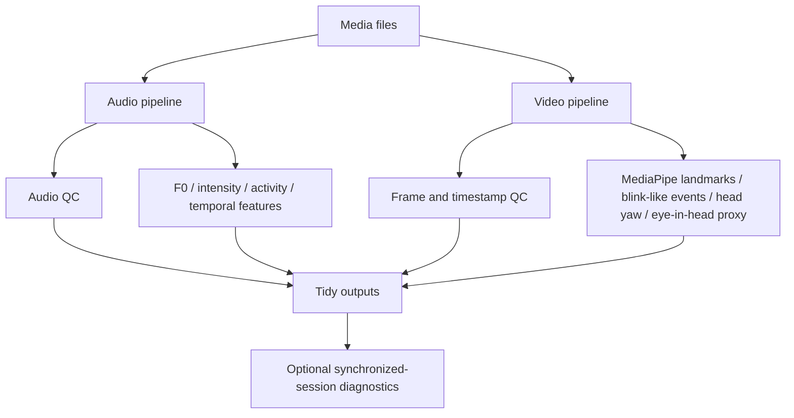

# Multimodal Audio-Video Signal Analysis

A Python toolkit for local acoustic and video-based behavioral signal analysis, with emphasis on reproducibility, quality control, missing-data handling, and scientifically cautious interpretation.

> This repository contains no participant recordings or derived participant data. Users are responsible for ensuring they have permission to process any media supplied to the pipeline.

## Overview

The project supports independent analysis of arbitrary media files and optional session-level diagnostics for recordings explicitly declared as synchronized. It separates reusable library code from demo code and exposes both a Python API and a command-line interface.

The public demo uses synthetic audio. Real video/ocular extraction requires a user-provided local video and a local MediaPipe Face Landmarker `.task` model; no identifiable face video is distributed with the repository.

## Features

### Acoustic

- media decoding and stream inspection with PyAV;
- clipping, DC offset, RMS/dBFS, and broad spectral QC;
- Praat/Parselmouth F0 trajectories with robust summary statistics;
- semitone-based pitch variability and adaptive pitch bounds;
- efficient frame-level relative intensity summaries;
- lightweight frame-energy activity detection;
- temporal activity features and time-resolved activity masks.

### Video / ocular

- resolution, FPS, frame count, duration, and timestamp QC;
- local MediaPipe Face Landmarker processing;
- face-present and usable-data masks;
- blink-like event and prolonged-closure summaries;
- head yaw kept separate from eye movement;
- normalized horizontal eye-in-head iris-offset proxy;
- rapid horizontal eye-proxy change detection;
- blink exclusion and missing-data-aware filtering that never bridges invalid gaps.

### Multimodal / session-level

- independent single-file analysis by default;
- optional synchronized-session mode for arbitrary `N >= 2` recordings;
- audio-envelope cross-correlation lag diagnostics;
- tidy CSV outputs for recording-level and synchronization QC.

## Architecture



## Installation

The pinned environment is intended for Python 3.13.

```bash
python -m venv .venv
.venv\Scripts\activate   # Windows
pip install -r requirements-dev.txt
pip install -e .
```

For runtime-only installation:

```bash
pip install -r requirements.txt
pip install -e . --no-deps
```

## Quick start

Generate safe synthetic audio:

```bash
python examples/generate_demo_audio.py
```

Inspect and analyze it:

```bash
python -m multimodal_signals.cli inspect data/demo_synthetic_voice.wav
python -m multimodal_signals.cli analyze data/demo_synthetic_voice.wav --output outputs/
```

Use the Python API:

```python
from multimodal_signals import analyze_audio, analyze_recording

audio = analyze_audio("data/demo_synthetic_voice.wav")
recording = analyze_recording("data/local_recording.mp4")
```

For ocular extraction, set `video.model_path` in a config file to a local MediaPipe Face Landmarker `.task` model and pass that config through the CLI/API.

Example synchronized-session analysis:

```bash
python -m multimodal_signals.cli session configs/example_session.json --output outputs/
```

## Supported inputs

The pipeline is designed to handle:

- MP4 or similar containers with audio and video;
- audio-only files;
- video-only files;
- arbitrary filenames and recording durations;
- multiple independent files;
- explicitly synchronized multi-camera/multi-microphone sessions;
- different sampling rates, channel counts, and FPS values.

Stereo audio is never collapsed silently. Configure `audio.channel` as `"mono"`, `"all"`, or a zero-based channel index. High-level acoustic analysis currently expects mono or a selected channel.

## Outputs

CLI runs write tidy CSVs under `outputs/`, including:

- `recording_summary.csv`;
- `acoustic_features.csv` for audio-only CLI runs;
- per-recording activity time series;
- `sync_qc.csv` for explicitly synchronized sessions.

## Methodological limitations

- Frame-energy activity is heuristic and is not ground-truth speech annotation or validated diarisation.
- Relative dB/dBFS features are recording levels, not calibrated SPL.
- Adaptive F0 bounds reduce some pitch-tracking failures but do not guarantee octave-error removal.
- The normalized horizontal eye-in-head proxy is **not** calibrated gaze, gaze angle, line of sight, or target identity.
- Head yaw and eye-in-head movement are estimated separately and are not combined into calibrated gaze.
- Blink-like and proxy-shift events are heuristic detector outputs rather than clinically validated blinks or physiological saccades.
- Synchronization diagnostics are consistency checks, not proof of exact clock alignment.

## Tests

```bash
pytest
```

Tests use synthetic arrays/signals and mock landmarks only; no private media is required.

## Privacy

Raw media, extracted audio, model files, caches, local work directories, and generated outputs are excluded by `.gitignore`. Keep identifiable media in ignored local folders such as `data/`, `media/`, or `private_data/`.

## References

- De Looze, C., & Hirst, D. J. (2008). *Detecting changes in key and range for the automatic modelling and coding of intonation*. Speech Prosody 2008.
- Boersma, P., & Weenink, D. *Praat: doing phonetics by computer*.
- Lugaresi, C. et al. (2019). *MediaPipe: A framework for building perception pipelines*.

## Roadmap

- optional validated speech/VAD or diarisation backends;
- calibrated gaze models;
- audio-video coupling after measured alignment;
- drift-aware synchronization;
- additional speech-rate features;
- batch reporting for longer datasets.
